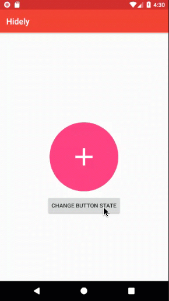

# Hidely
Custom Views that can hide/show a View with some Animations (inspired by the Android FAB)


## Demo


<p float="left">
  
   
  
</p>


## Install
```gradle
dependencies {
    compile 'com.devlomi.hidely:hidely:1.0.0'
}
```


## Usage

## Basic Usage
use one of the following `Hidely` Views 

* `HidelyButton`
* `HidelyImageButton`
* `HidelyImageView`
* `HidelyView`


* `HidelyFrameLayout`
* `HidelyRelativeLayout`
* `HidelyLinearLayout`

## OR 

if you want to make your own custom view then :

1. make your own custom view and make it **implements**  `HidelyInterface` this will give you the 4 methods `show()` , `hide()` ,`isShowing()` and `setAnimationCallbacks()`
2. make an Object from `HidelyCore` and pass the view as a Parameter:
`hidelyCore = new HidelyCore(this);`
3. fill the 4 methods with hidely core like this

```java

   @Override
    public void show() {
        if (hidelyCore != null)
            hidelyCore.show();
    }

    @Override
    public void hide() {
        if (hidelyCore != null)
            hidelyCore.hide();
    }

    @Override
    public boolean isShowing() {
        return hidelyCore == null ? false : hidelyCore.isShowingHidely();
    }

    @Override
    public void setAnimationCallbacks(HidelyAnimationCallbacks animationCallbacks) {
        hidelyCore.setAnimationListener(animationCallbacks);
    }

```

### XML

```xml

<?xml version="1.0" encoding="utf-8"?>
<RelativeLayout xmlns:android="http://schemas.android.com/apk/res/android"
    xmlns:app="http://schemas.android.com/apk/res-auto"
    xmlns:tools="http://schemas.android.com/tools"
    android:layout_width="match_parent"
    android:layout_height="match_parent"
    tools:context=".SimpleExample">

    <com.devlomi.hidely.hidelyviews.HidelyImageButton
        android:id="@+id/simple_example_hidely"
        android:layout_width="wrap_content"
        android:layout_height="wrap_content"
        android:layout_centerInParent="true"
        android:background="@drawable/circle_bg"
        android:padding="50dp"
        android:src="@drawable/ic_add" />


    <Button
        android:id="@+id/change_button_state"
        android:layout_width="wrap_content"
        android:layout_height="wrap_content"
        android:layout_below="@id/simple_example_hidely"
        android:layout_centerHorizontal="true"
        android:layout_marginTop="8dp"
        android:text="CHANGE BUTTON STATE" />

</RelativeLayout>


```


### Java

```java

        HidelyImageButton hidelyImageButton = findViewById(R.id.simple_example_hidely);
        Button changeButtonState = findViewById(R.id.change_button_state);

        changeButtonState.setOnClickListener(new View.OnClickListener() {
            @Override
            public void onClick(View view) {
                //check if button is Showing
                if (hidelyImageButton.isShowing())
                //hide button
                    hidelyImageButton.hide();
                else
                //show button
                    hidelyImageButton.show();
            }
        });

```

### Listen for Animation Callbacks

```java

 hidelyImageButton.setAnimationCallbacks(new HidelyAnimationCallbacks() {
            @Override
            public void onAnimationStart() {
                
            }

            @Override
            public void onAnimationEnd() {

            }
        });
        
```

